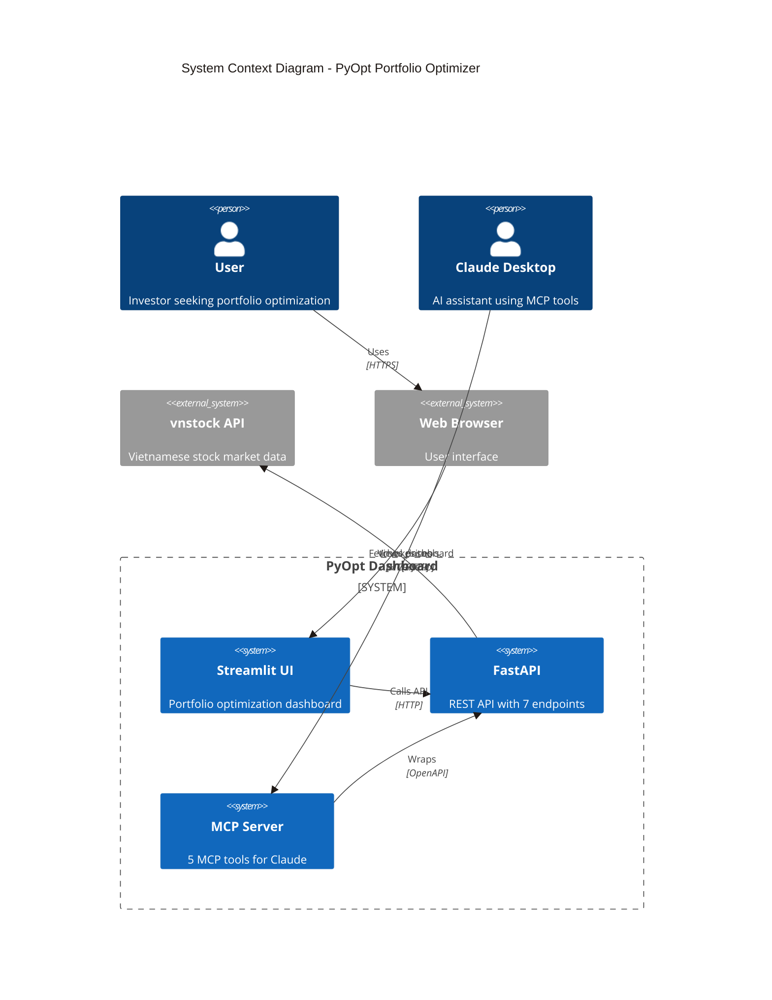

# System Context

> C4 Level 1: System Context Diagram

## Overview

PyOpt is a portfolio optimization tool for the Vietnamese stock market. It provides a web-based dashboard for investors and MCP tools for AI assistants like Claude Desktop.

## Diagram

## System Actors

### Primary Actors

| Actor | Description | Interface |
|-------|-------------|-----------|
| **User** | Vietnamese investor seeking portfolio optimization | Web browser |
| **Claude Desktop** | AI assistant helping users with investment decisions | MCP protocol |

### External Systems

| System | Description | Protocol |
|--------|-------------|----------|
| **vnstock API** | Vietnamese stock market data provider (HOSE, HNX, UPCOM) | HTTP/REST |
| **Web Browser** | User interface for accessing the dashboard | HTTP |

## System Scope

### In Scope

- Portfolio optimization using Modern Portfolio Theory
- Three optimization strategies: Max Sharpe, Min Volatility, Max Utility
- Hierarchical Risk Parity (HRP) optimization
- Discrete share allocation in VND
- Risk metrics calculation (24 metrics)
- Excel report generation
- MCP tools for Claude Desktop integration

### Out of Scope

- Real-time trading execution
- Backtesting with historical strategies
- User authentication and portfolio persistence
- Multi-user support
- Mobile applications