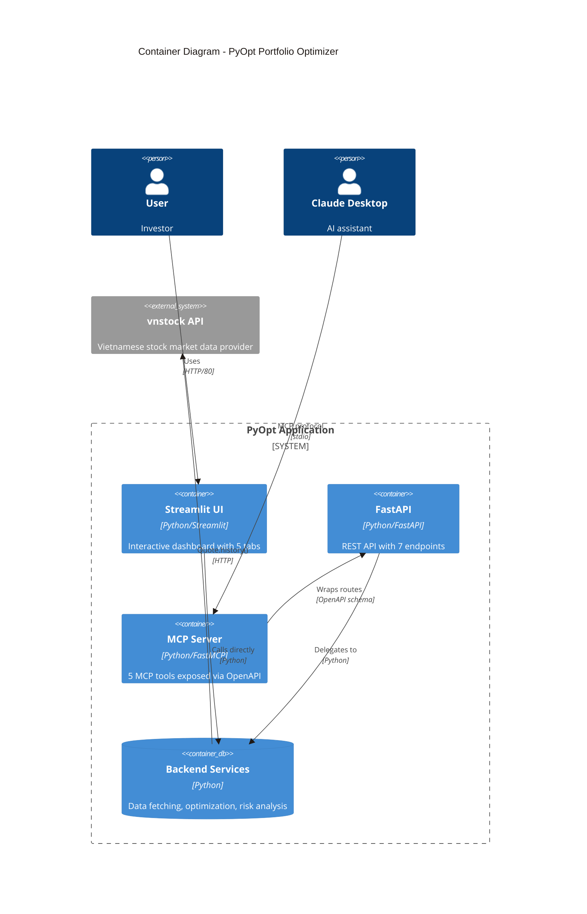

# Container Architecture

> C4 Level 2: Container Diagram

## Overview

PyOpt runs as a single ASGI application with three logical containers: Streamlit UI, FastAPI backend, and MCP Server. All containers share the same process and backend services.

## Diagram



## Containers

### Streamlit UI

| Property | Value |
|----------|-------|
| **Technology** | Python, Streamlit |
| **Port** | 80 (configurable) |
| **Path** | `/` |
| **Purpose** | Interactive portfolio optimization dashboard |

**Features:**
- 5 tabs: Efficient Frontier & Weights, HRP, Dollars Allocation, Report, Risk Analysis
- Sidebar controls for ticker selection, date range, risk aversion
- Caching via `@st.cache_data`
- Matplotlib charts (efficient frontier, dendrogram, risk plots)
- Altair donut charts (portfolio weights)
- Excel report download

### FastAPI

| Property | Value |
|----------|-------|
| **Technology** | Python, FastAPI |
| **Port** | Same as Streamlit (shared process) |
| **Path** | `/api` |
| **Purpose** | REST API for programmatic access |

**Endpoints:**
- `GET /api/health` — Health check
- `GET /api/info` — App metadata
- `GET /api/symbols` — List stock symbols
- `POST /api/optimize` — Run all 3 strategies
- `POST /api/hrp` — HRP optimization
- `POST /api/allocate` — Discrete allocation
- `POST /api/risk` — Risk metrics

### MCP Server

| Property | Value |
|----------|-------|
| **Technology** | Python, FastMCP |
| **Protocol** | MCP over stdio |
| **Purpose** | Claude Desktop integration |

**MCP Tools (5):**
- `symbols` — List available stock symbols
- `optimize` — Run portfolio optimization
- `hrp` — Run HRP optimization
- `allocate` — Convert weights to shares
- `risk` — Compute risk metrics

### Backend Services

| Service | File | Purpose |
|---------|------|---------|
| **data_service** | `backend/services/data_service.py` | vnstock data fetching |
| **optimization_service** | `backend/services/optimization_service.py` | PyPortfolioOpt integration |
| **risk_service** | `backend/services/risk_service.py` | riskfolio-lib integration |

## Communication Patterns

| From | To | Protocol | Purpose |
|------|-----|----------|---------|
| User Browser | Streamlit | HTTP | Dashboard access |
| Claude Desktop | MCP Server | MCP/stdio | Tool invocation |
| Streamlit | Backend Services | Python | Direct function calls |
| FastAPI | Backend Services | Python | Direct function calls |
| MCP Server | FastAPI | OpenAPI | Route discovery |
| Backend Services | vnstock | HTTP | Stock data fetching

## Deployment

Single-process ASGI application:

```bash
# Run locally
uv run pyopt

# Or with uvicorn
uvicorn app:app --reload

# MCP server (separate process)
uv run python server.py
```

**Render.com deployment:**
- Single web service
- Python native runtime with uv
- Port 80 (configurable)