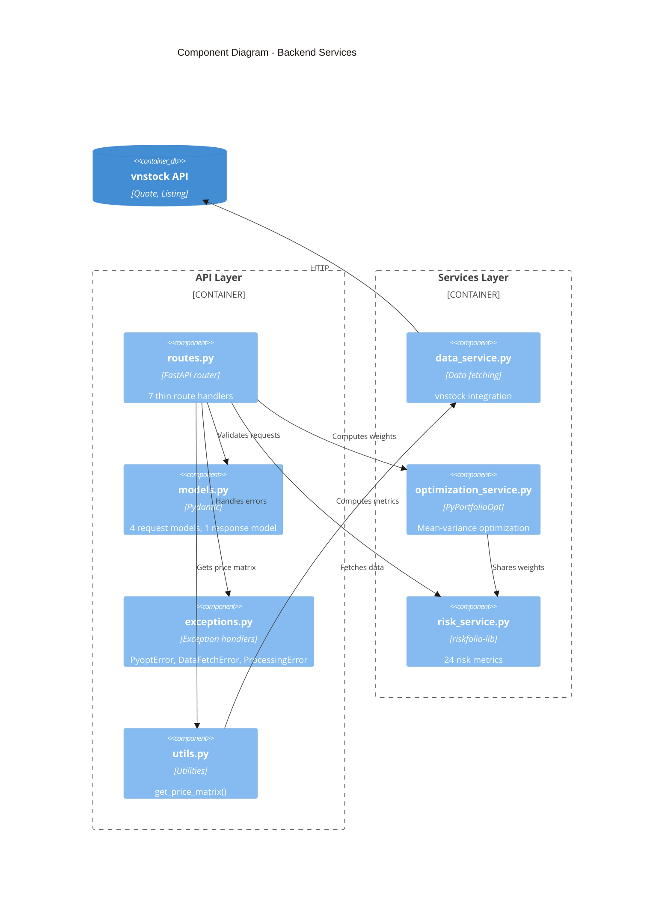

# Component Architecture

> C4 Level 3: Component Diagram

## Overview

The backend is organized into two layers: API layer (thin handlers) and Services layer (business logic). This separation ensures framework-agnostic business logic that can be reused across Streamlit, FastAPI, and MCP.

## Diagram

## API Layer

### routes.py

Thin route handlers that delegate to services.

| Function | Method | Path | Purpose |
|----------|--------|------|---------|
| `health()` | GET | `/health` | Service health check |
| `info()` | GET | `/info` | App metadata + strategies |
| `symbols()` | GET | `/symbols` | List stock symbols |
| `optimize()` | POST | `/optimize` | Run all 3 strategies |
| `hrp()` | POST | `/hrp` | HRP optimization |
| `allocate()` | POST | `/allocate` | Discrete allocation |
| `risk()` | POST | `/risk` | Risk metrics |

### models.py

Pydantic models for request/response validation.

**Request Models:**

| Model | Fields |
|-------|--------|
| `OptimizeRequest` | symbols, start_date, end_date, risk_aversion |
| `HRPRequest` | symbols, start_date, end_date |
| `AllocateRequest` | symbols, start_date, end_date, strategy, portfolio_value, risk_aversion |
| `RiskRequest` | symbols, start_date, end_date, strategy, risk_aversion, alpha |

**Response Models:**

| Model | Fields |
|-------|--------|
| `PortfolioResultResponse` | weights, expected_return, volatility, sharpe_ratio |

### exceptions.py

Domain-specific exceptions with HTTP error handlers.

| Exception | HTTP Code | Description |
|-----------|-----------|-------------|
| `PyoptError` | 500 | Base exception |
| `DataFetchError` | 502 | Upstream vnstock failure |
| `ProcessingError` | 422 | Invalid price data |

### utils.py

Shared utilities for data fetching.

| Function | Purpose |
|----------|---------|
| `get_price_matrix()` | Fetch raw data and process into price DataFrame |

## Services Layer

### data_service.py

vnstock data fetching with zero framework dependencies.

| Function | Signature | Purpose |
|----------|-----------|---------|
| `load_stock_symbols()` | `() -> list[str]` | List all HOSE/HNX/UPCOM symbols |
| `fetch_portfolio_stock_data()` | `(symbols, start, end, interval) -> dict[str, DataFrame]` | Fetch historical data |
| `process_portfolio_price_data()` | `(dict) -> DataFrame` | Convert to price matrix |
| `compute_returns()` | `(DataFrame) -> DataFrame` | Calculate percentage returns |

### optimization_service.py

PyPortfolioOpt integration with dataclass results.

| Dataclass | Fields |
|-----------|--------|
| `PortfolioResult` | weights, expected_return, volatility, sharpe_ratio |
| `OptimizationResults` | max_sharpe, min_volatility, max_utility, mu, cov_matrix |
| `HRPResult` | weights, hrp_instance |
| `AllocationResult` | allocation, leftover, latest_prices_actual |

| Function | Purpose |
|----------|---------|
| `compute_optimizations()` | Run all 3 strategies (Max Sharpe, Min Vol, Max Utility) |
| `compute_single_strategy()` | Run a single strategy |
| `compute_hrp()` | Hierarchical Risk Parity |
| `compute_discrete_allocation()` | Convert weights to share counts |

**Key constants:**
- `VNSTOCK_PRICE_UNIT = 1000` — vnstock prices are in thousands
- `STRATEGY_CHOICES` — List of strategy names

### risk_service.py

riskfolio-lib integration for 24 risk metrics.

| Function | Purpose |
|----------|---------|
| `compute_risk_metrics()` | Compute all risk metrics |

**Returns dict with 4 categories:**

| Category | Metrics (12 total) |
|----------|-------------------|
| **Profitability** | mean_return, cagr, mar, alpha |
| **Return-based Risks** | std_dev, mad, semi_deviation, flpm, slpm, var, cvar, evar, tail_gini, rlvar, worst_realization, skewness, kurtosis |
| **Drawdown-based Risks** | ulcer_index, avg_drawdown, dar, cdar, edar, rldar, max_drawdown |
| **Risk-adjusted Ratios** | All ratios calculated (mean_return - mar) / risk |

**Constants:**
- `T_FACTOR = 252` — Trading days per year
- `DAYS_PER_YEAR = 252`

## Isolation Boundaries

The architecture enforces strict separation:

| Layer | Can Import From | Cannot Import |
|-------|-----------------|---------------|
| API Layer | Services, Pydantic, FastAPI | Streamlit, matplotlib, altair |
| Services Layer | vnstock, PyPortfolioOpt, riskfolio, pandas | FastAPI, Streamlit, Pydantic |

This ensures:
- Services are testable in isolation
- No framework coupling in business logic
- Streamlit and FastAPI share the same services