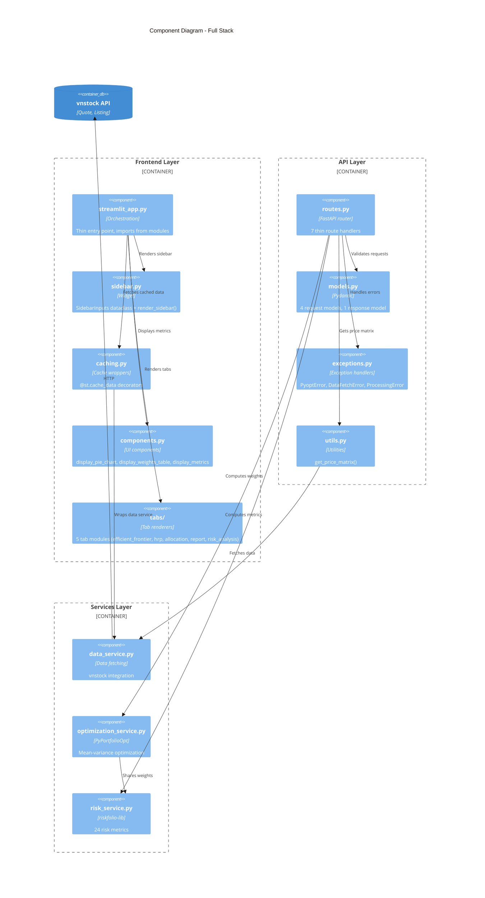

# Component Architecture

> C4 Level 3: Component Diagram

## Overview

The application is organized into three layers: Frontend (Streamlit UI), API layer (thin handlers), and Services layer (business logic). This separation ensures framework-agnostic business logic that can be reused across Streamlit, FastAPI, and MCP.

## Diagram



## Frontend Layer

The frontend package (`frontend/`) contains all Streamlit-specific code, keeping the backend framework-agnostic.

### Package Structure

```
frontend/
├── __init__.py          # Package exports
├── caching.py           # @st.cache_data wrappers
├── components.py        # Reusable UI components
├── sidebar.py           # Sidebar widget + SidebarInputs dataclass
└── tabs/
    ├── __init__.py
    ├── efficient_frontier.py  # Efficient Frontier tab
    ├── hrp.py                 # HRP tab
    ├── allocation.py          # Dollars Allocation tab
    ├── report.py              # Report tab
    └── risk_analysis.py       # Risk Analysis tab
```

### caching.py

Thin `@st.cache_data` decorators that delegate to backend services.

| Function | Cache Key | Max Entries |
|----------|-----------|-------------|
| `load_stock_symbols()` | None (singleton) | 1 |
| `fetch_portfolio_stock_data()` | symbols tuple, dates, interval | Unlimited |
| `cached_compute_optimizations()` | prices_df hash, risk_aversion | Unlimited |
| `cached_compute_hrp()` | returns hash | Unlimited |

### sidebar.py

Sidebar widget with input validation.

| Component | Purpose |
|-----------|---------|
| `SidebarInputs` | Dataclass holding all user inputs (symbols, dates, risk_aversion, colormap) |
| `render_sidebar()` | Renders sidebar widgets, returns `SidebarInputs` instance |
| `COLORMAP_OPTIONS` | List of available colormap choices |

**SidebarInputs fields:**

| Field | Type | Description |
|-------|------|-------------|
| `symbols` | `list[str]` | Selected stock symbols |
| `start_date` | `date` | Start date for historical data |
| `end_date` | `date` | End date for historical data |
| `risk_aversion` | `float` | Risk aversion parameter (0.1-10.0) |
| `colormap` | `str` | Colormap for scatter plot |
| `interval` | `str` | Data interval (default: "1D") |

### components.py

Reusable UI components for display across tabs.

| Function | Purpose |
|----------|---------|
| `display_weights_table()` | Render weights dict as formatted dataframe |
| `display_pie_chart()` | Create Altair donut chart for portfolio weights |
| `display_performance_metrics()` | 3-column metrics for all strategies |
| `display_data_summary()` | Symbols count, data points, price preview |
| `inject_custom_success_styling()` | Earth-tone CSS for success alerts |

### tabs/

Each tab module exports a single `render_*_tab()` function.

| Module | Function | Purpose |
|--------|----------|---------|
| `efficient_frontier.py` | `render_efficient_frontier_tab()` | Scatter plot + weights tables + pie charts |
| `hrp.py` | `render_hrp_tab()` | HRP weights + dendrogram |
| `allocation.py` | `render_allocation_tab()` | Discrete allocation to VND shares |
| `report.py` | `render_report_tab()` | Excel report generation |
| `risk_analysis.py` | `render_risk_analysis_tab()` | Risk metrics table + drawdown + range plots |

## API Layer

### routes.py

Thin route handlers that delegate to services.

| Function | Method | Path | Purpose |
|----------|--------|------|---------|
| `health()` | GET | `/health` | Service health check |
| `info()` | GET | `/info` | App metadata + strategies |
| `symbols()` | GET | `/symbols` | List stock symbols |
| `optimize()` | POST | `/optimize` | Run all 3 strategies |
| `hrp()` | POST | `/hrp` | HRP optimization |
| `allocate()` | POST | `/allocate` | Discrete allocation |
| `risk()` | POST | `/risk` | Risk metrics |

### models.py

Pydantic models for request/response validation.

**Request Models:**

| Model | Fields |
|-------|--------|
| `OptimizeRequest` | symbols, start_date, end_date, risk_aversion |
| `HRPRequest` | symbols, start_date, end_date |
| `AllocateRequest` | symbols, start_date, end_date, strategy, portfolio_value, risk_aversion |
| `RiskRequest` | symbols, start_date, end_date, strategy, risk_aversion, alpha |

**Response Models:**

| Model | Fields |
|-------|--------|
| `PortfolioResultResponse` | weights, expected_return, volatility, sharpe_ratio |

### exceptions.py

Domain-specific exceptions with HTTP error handlers.

| Exception | HTTP Code | Description |
|-----------|-----------|-------------|
| `PyoptError` | 500 | Base exception |
| `DataFetchError` | 502 | Upstream vnstock failure |
| `ProcessingError` | 422 | Invalid price data |

### utils.py

Shared utilities for data fetching.

| Function | Purpose |
|----------|---------|
| `get_price_matrix()` | Fetch raw data and process into price DataFrame |

## Services Layer

### data_service.py

vnstock data fetching with zero framework dependencies.

| Function | Signature | Purpose |
|----------|-----------|---------|
| `load_stock_symbols()` | `() -> list[str]` | List all HOSE/HNX/UPCOM symbols |
| `fetch_portfolio_stock_data()` | `(symbols, start, end, interval) -> dict[str, DataFrame]` | Fetch historical data |
| `process_portfolio_price_data()` | `(dict) -> DataFrame` | Convert to price matrix |
| `compute_returns()` | `(DataFrame) -> DataFrame` | Calculate percentage returns |

### optimization_service.py

PyPortfolioOpt integration with dataclass results.

| Dataclass | Fields |
|-----------|--------|
| `PortfolioResult` | weights, expected_return, volatility, sharpe_ratio |
| `OptimizationResults` | max_sharpe, min_volatility, max_utility, mu, cov_matrix |
| `HRPResult` | weights, hrp_instance |
| `AllocationResult` | allocation, leftover, latest_prices_actual |

| Function | Purpose |
|----------|---------|
| `compute_optimizations()` | Run all 3 strategies (Max Sharpe, Min Vol, Max Utility) |
| `compute_single_strategy()` | Run a single strategy |
| `compute_hrp()` | Hierarchical Risk Parity |
| `compute_discrete_allocation()` | Convert weights to share counts |

**Key constants:**
- `VNSTOCK_PRICE_UNIT = 1000` — vnstock prices are in thousands
- `STRATEGY_CHOICES` — List of strategy names

### risk_service.py

riskfolio-lib integration for 24 risk metrics.

| Function | Purpose |
|----------|---------|
| `compute_risk_metrics()` | Compute all risk metrics |

**Returns dict with 4 categories:**

| Category | Metrics (12 total) |
|----------|-------------------|
| **Profitability** | mean_return, cagr, mar, alpha |
| **Return-based Risks** | std_dev, mad, semi_deviation, flpm, slpm, var, cvar, evar, tail_gini, rlvar, worst_realization, skewness, kurtosis |
| **Drawdown-based Risks** | ulcer_index, avg_drawdown, dar, cdar, edar, rldar, max_drawdown |
| **Risk-adjusted Ratios** | All ratios calculated (mean_return - mar) / risk |

**Constants:**
- `T_FACTOR = 252` — Trading days per year
- `DAYS_PER_YEAR = 252`

## Isolation Boundaries

The architecture enforces strict separation:

| Layer | Can Import From | Cannot Import |
|-------|-----------------|---------------|
| Frontend Layer | Backend services, Streamlit, matplotlib, altair | FastAPI, Pydantic |
| API Layer | Services, Pydantic, FastAPI | Streamlit, matplotlib, altair |
| Services Layer | vnstock, PyPortfolioOpt, riskfolio, pandas | FastAPI, Streamlit, Pydantic |

**Frontend isolation:**
- `streamlit_app.py` is a thin orchestration layer (~180 lines)
- All `@st.cache_data` decorators live in `frontend/caching.py`
- Tab rendering logic is isolated in `frontend/tabs/`

**Backend isolation:**
- `backend/` has zero Streamlit imports
- Services are testable in isolation
- FastAPI and Streamlit share the same services